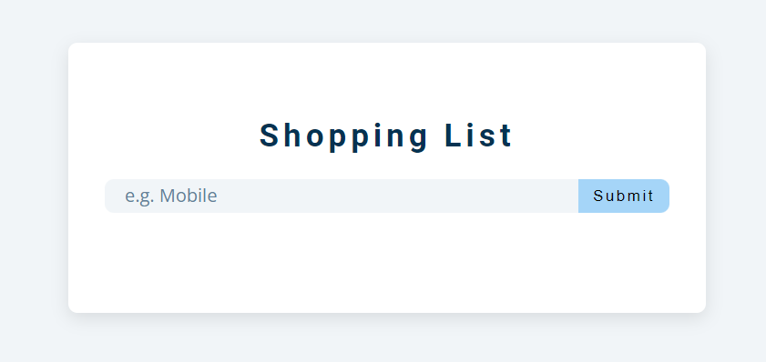
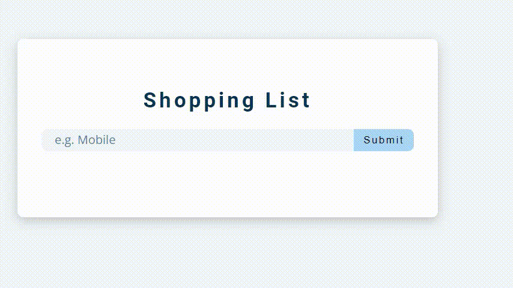

# Shopping List Web Application


## Description

The Shopping List Web Application is a simple tool that allows users to manage their shopping list efficiently. The application provides a user-friendly interface for adding, editing, and removing items from the list. It's built using HTML, CSS, and JavaScript, making it lightweight and responsive.



## Functionality

- Add Items: Users can easily add new items to their shopping list by entering the item name in the input field and clicking the "Add" button.

- Edit Items: If users need to modify an existing item, they can click the "Edit" button next to the item, make the necessary changes, and then click the "Submit" button to update the item.

- Remove Items: To remove an item from the shopping list, users can click the "Delete" button next to the item, and it will be instantly removed.



## How to Use

1. Visit the live website: [Shopping List App](https://ng-shopping-list.netlify.app/)

2. Add Items:
   - Enter the name of the item you want to add to your shopping list in the input field.
   - Click the "Add" button or press "Enter" to add the item to the list.

3. Edit Items:
   - To edit an existing item, click the "Edit" button (pencil icon) next to the item you want to modify.
   - The item's name will appear in the input field.
   - Edit the item's name in the input field as needed.
   - Click the "Submit" button (or press "Enter") to save the changes.

4. Remove Items:
   - To remove an item from the shopping list, click the "Delete" button (trash icon) next to the item you want to remove.
   - The item will be removed from the list.

5. Clear All Items:
   - If you want to clear the entire shopping list, click the "Clear Items" button at the bottom of the list.

## Installation

To run this application locally, you need to:

1. Clone the repository to your local machine:

   ```bash
   git clone https://github.com/your-username/shopping-list.git
2. Open the index.html file in your web browser.

3. Start using the Shopping List application as described in the "How to Use" section above.

## Dependencies
This project uses the following external libraries:

- Font Awesome: Used to provide icons for buttons in the application.
  
- License: This project is licensed under the MIT License.

## Contact
For any questions or inquiries, feel free to contact the project maintainer:

Name: Niladri Ghoshal

Email: niladrighoshal.14@gmail.com
